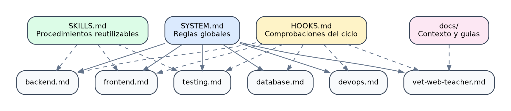

# Estructura inicial de archivos para IA y Codex

## 1. Objetivo

Este documento explica los archivos Markdown que orientan a Codex y a otros agentes de IA dentro del repositorio.

Estos archivos no forman parte de la aplicacion que se ejecuta en el navegador. Su funcion es mantener decisiones, responsabilidades y procesos de trabajo de forma persistente.

{width=90%}

*Figura 1. Gobierno documental de los agentes del proyecto.*

## 2. Estructura

```text
.
├── SYSTEM.md
├── SKILLS.md
├── HOOKS.md
├── AGENTS/
│   ├── backend.md
│   ├── database.md
│   ├── devops.md
│   ├── frontend.md
│   ├── testing.md
│   └── vet-web-teacher.md
└── docs/
    ├── README.md
    └── ...
```

## 3. SYSTEM.md

`SYSTEM.md` define las reglas globales del repositorio.

Debe explicar:

- Que tipo de proyecto es.
- Que tecnologias utiliza.
- Que estructura de carpetas se espera.
- Que patrones se prefieren.
- Que practicas de seguridad son obligatorias.
- Que comandos deben ejecutarse antes de finalizar.

Ejemplo conceptual:

```md
## Engineering Defaults

- TypeScript en cliente y servidor.
- Controladores Express pequenos.
- Servicios para reglas de negocio.
- Signals para estado Angular.
- Fetch para comunicacion HTTP.
- Bootstrap para componentes visuales.
```

### Cuando actualizarlo

Actualiza `SYSTEM.md` cuando una decision afecte a todo el proyecto:

- Cambiar el patron HTTP de `HttpClient` a Fetch.
- Adoptar Signals.
- Adoptar Bootstrap.
- Incorporar OpenAI.
- Cambiar los requisitos de seguridad.

No debe contener instrucciones temporales de una unica tarea.

## 4. AGENTS

Cada archivo de `AGENTS/` describe un rol especializado.

### backend.md

Responsable de:

- Express.
- Rutas.
- Controladores.
- Servicios.
- Validacion.
- Errores HTTP.
- Integraciones externas como OpenAI.

Flujo esperado:

```text
route -> middleware -> controller -> service -> model
```

### database.md

Responsable de:

- Esquemas Mongoose.
- Indices.
- Relaciones.
- Compatibilidad de datos.
- Migraciones.
- Rendimiento de consultas.

### frontend.md

Responsable de:

- Angular.
- Signals y estado derivado.
- Fetch y promesas.
- `AbortController`.
- Formularios reactivos.
- Bootstrap.
- Accesibilidad y responsive.

### testing.md

Responsable de:

- Estrategia de pruebas.
- Pruebas unitarias.
- Pruebas de integracion.
- Pruebas de regresion.
- Fixtures y datos temporales.

### devops.md

Responsable de:

- npm workspaces.
- Scripts.
- Docker.
- Variables de entorno.
- CI.
- Documentacion de arranque.

### vet-web-teacher.md

Responsable de transformar la implementacion en material docente:

- Objetivos de aprendizaje.
- Escenario veterinario.
- Ejercicios.
- Preguntas de revision.
- Explicaciones progresivas.

## 5. SKILLS.md

`SKILLS.md` define capacidades reutilizables.

Una skill responde a la pregunta:

> Que procedimiento debe seguir el agente cuando aparece este tipo de tarea?

Ejemplos:

- Descubrir el proyecto.
- Crear una funcionalidad backend.
- Crear una funcionalidad Angular.
- Modificar un modelo MongoDB.
- Revisar un contrato API.
- Refactorizar.
- Preparar el entorno.

Una skill debe incluir:

```text
Nombre
Cuando utilizarla
Acciones
Verificacion
```

## 6. HOOKS.md

`HOOKS.md` define puntos de control del ciclo de trabajo.

Ejemplos:

- Al comenzar una sesion.
- Antes de editar.
- Despues de editar.
- Al cambiar un contrato API.
- Al cambiar una dependencia.
- Al modificar un esquema.
- Al incorporar OpenAI.
- Antes de un commit.
- Antes de finalizar.

Los hooks ayudan a evitar que una tarea termine solo porque el codigo "parece correcto".

Ejemplo:

```bash
git diff --check
npm run build
npm run lint
npm test
```

## 7. docs

`docs/` contiene documentacion para personas.

La diferencia principal es:

| Archivo | Audiencia |
| --- | --- |
| `SYSTEM.md` | Agente que trabaja en todo el repositorio |
| `AGENTS/*.md` | Agente especializado |
| `SKILLS.md` | Agente que ejecuta un procedimiento |
| `HOOKS.md` | Agente o automatizacion que verifica un momento del ciclo |
| `docs/*.md` | Estudiante, docente o desarrollador |

## 8. Orden de lectura para un agente

Al comenzar una tarea:

1. Leer `SYSTEM.md`.
2. Leer el agente relacionado.
3. Consultar `SKILLS.md`.
4. Consultar `HOOKS.md`.
5. Leer la documentacion funcional relacionada.
6. Inspeccionar el codigo existente.

## 9. Como anadir un agente

Ejemplo: agente especializado en seguridad.

Crear:

```text
AGENTS/security.md
```

Contenido minimo:

```md
# Security Agent

## Scope

## Responsibilities

## Security Checks

## Done Criteria
```

Despues:

1. Anadirlo al arbol de `SYSTEM.md`.
2. Relacionarlo con hooks si necesita comprobaciones.
3. Actualizar `docs/` si introduce un nuevo flujo para estudiantes.

## 10. Errores frecuentes

- Duplicar la misma regla en todos los archivos.
- Mezclar una instruccion temporal con una convencion permanente.
- Crear agentes sin una responsabilidad concreta.
- Documentar comandos que no existen en `package.json`.
- No actualizar las guias cuando cambia la arquitectura.
- Incluir secretos o valores reales de `.env`.

## 11. Lista de comprobacion

- [ ] `SYSTEM.md` refleja la arquitectura actual.
- [ ] Cada agente tiene un alcance diferente.
- [ ] `SKILLS.md` explica procesos reutilizables.
- [ ] `HOOKS.md` contiene verificaciones ejecutables.
- [ ] `docs/` explica el proyecto para personas.
- [ ] Los comandos documentados existen.
- [ ] No hay secretos en Markdown.
