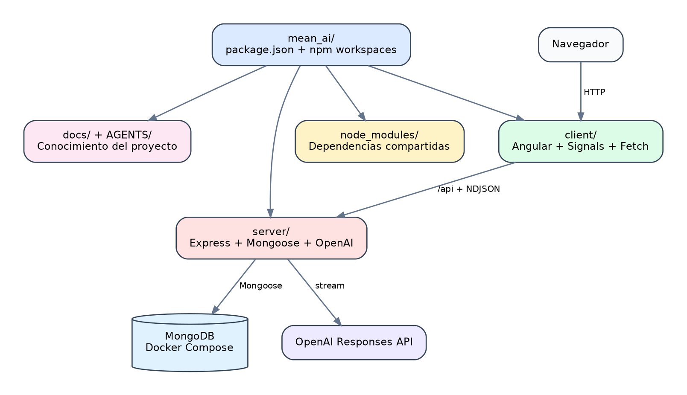

# Monorepo y estructura de carpetas

## 1. Que es un monorepo

Un monorepo almacena varias aplicaciones o paquetes relacionados dentro de un unico repositorio Git.

En este proyecto hay dos workspaces:

```text
client  Aplicacion Angular
server  API Express
```

Ambos comparten:

- Historial Git.
- `package-lock.json`.
- `node_modules` en la raiz.
- Scripts de compilacion y pruebas.
- Documentacion.
- Configuracion de desarrollo.

{width=92%}

*Figura 2. Componentes principales y relaciones del monorepo.*

## 2. Configuracion con npm workspaces

El `package.json` raiz contiene:

```json
{
  "private": true,
  "workspaces": [
    "server",
    "client"
  ]
}
```

`private: true` evita publicar accidentalmente el paquete raiz.

La propiedad `workspaces` indica a npm que `client/` y `server/` son paquetes del mismo proyecto.

## 3. Instalacion

Ejecutar siempre desde la raiz:

```bash
npm install
```

El resultado principal es:

```text
node_modules/
package-lock.json
client/package.json
server/package.json
```

npm crea enlaces internos para los workspaces y eleva dependencias compatibles al `node_modules` raiz.

No es necesario ejecutar `npm install` por separado en cada carpeta.

## 4. Scripts de la raiz

```bash
npm run dev
npm run frontend
npm run backend
npm run build
npm run test
npm run lint
```

Ejemplo:

```json
{
  "scripts": {
    "frontend": "npm run start -w client",
    "backend": "npm run dev -w server",
    "build": "npm run build -w server && npm run build -w client"
  }
}
```

La opcion `-w` selecciona un workspace.

## 5. Arbol principal

```text
.
├── .github/
│   └── workflows/
├── .vscode/
│   └── launch.json
├── AGENTS/
├── docs/
├── client/
├── server/
├── .env
├── .env.example
├── .gitignore
├── docker-compose.yml
├── HOOKS.md
├── package.json
├── package-lock.json
├── README.md
├── SKILLS.md
└── SYSTEM.md
```

## 6. Carpeta client

```text
client/
├── angular.json
├── package.json
├── tsconfig.json
├── tsconfig.app.json
├── tsconfig.spec.json
└── src/
    ├── app/
    │   ├── core/
    │   ├── features/
    │   ├── shared/
    │   ├── app.component.*
    │   ├── app.config.ts
    │   └── app.routes.ts
    ├── environments/
    ├── styles/
    ├── index.html
    └── main.ts
```

### core

Servicios que dan soporte a toda la aplicacion:

```text
core/services/fetch-api.ts
core/services/product.service.ts
core/services/product-category.service.ts
```

### features

Funcionalidades visibles:

```text
features/products/
features/product-categories/
features/home/
```

### shared

Tipos compartidos:

```text
shared/models/api-response.model.ts
shared/models/product.model.ts
shared/models/product-category.model.ts
```

## 7. Carpeta server

```text
server/
├── package.json
├── tsconfig.json
├── vitest.config.ts
├── tests/
└── src/
    ├── config/
    ├── controllers/
    ├── middleware/
    ├── models/
    ├── routes/
    ├── services/
    ├── types/
    ├── utils/
    ├── app.ts
    └── main.ts
```

Responsabilidad de cada capa:

| Carpeta | Responsabilidad |
| --- | --- |
| `config` | Variables, MongoDB y CORS |
| `models` | Esquemas Mongoose |
| `services` | Reglas de negocio |
| `controllers` | Adaptacion entre HTTP y servicios |
| `routes` | Metodos y URLs |
| `middleware` | Errores y rutas no encontradas |
| `types` | Contratos TypeScript |
| `utils` | Utilidades compartidas |
| `tests` | Pruebas backend |

## 8. Flujo de una peticion

```text
Angular
  -> Fetch
  -> Express route
  -> Controller
  -> Service
  -> Mongoose model
  -> MongoDB
```

Respuesta:

```text
MongoDB
  -> Model
  -> Service
  -> Controller
  -> JSON
  -> Fetch
  -> Signal
  -> Template Angular
```

## 9. Variables de entorno

El archivo real:

```text
.env
```

El archivo documentado:

```text
.env.example
```

`.env` esta ignorado por Git.

Ejemplo:

```dotenv
PORT=3000
MONGODB_URI=mongodb://localhost:27017/mean_ai
CLIENT_ORIGIN=http://localhost:4200
OPENAI_API_KEY=replace-me
OPENAI_MODEL=gpt-5.4-mini
```

El backend busca `.env` en la raiz aunque npm ejecute el workspace desde `server/`.

## 10. Docker y MongoDB

MongoDB se define en:

```text
docker-compose.yml
```

Arranque:

```bash
sudo docker compose up -d mongo
```

Comprobacion:

```bash
sudo docker compose ps
```

## 11. Depuracion

`.vscode/launch.json` contiene:

- `Debug Backend`.
- `Attach Backend`.

`Debug Backend` ejecuta TypeScript mediante `tsx`, carga `.env` desde la raiz y utiliza `server/` como directorio de trabajo.

Antes de depurar, detener cualquier servidor que ocupe el puerto `3000`.

## 12. Builds y salidas

```text
client/dist/
server/dist/
```

Estas carpetas son generadas y no deben versionarse.

## 13. Ventajas del monorepo

- Cambios frontend y backend en un mismo commit.
- Contratos API faciles de coordinar.
- Un solo comando para instalar.
- CI centralizado.
- Documentacion comun.
- Menos duplicacion de herramientas.

## 14. Riesgos

- Scripts raiz mal sincronizados.
- Dependencias que se resuelven desde lugares inesperados.
- Watchers que observan todo `node_modules`.
- Confusion sobre donde vive `.env`.
- Compilaciones completas mas lentas.

Este proyecto limita `tsx watch` a `server/src/**/*.ts` para evitar agotar watchers de Linux.

## 15. Comprobacion

```bash
npm install
npm run typecheck:backend
npm run build:frontend
npm run test:backend
npm run test:frontend
```
