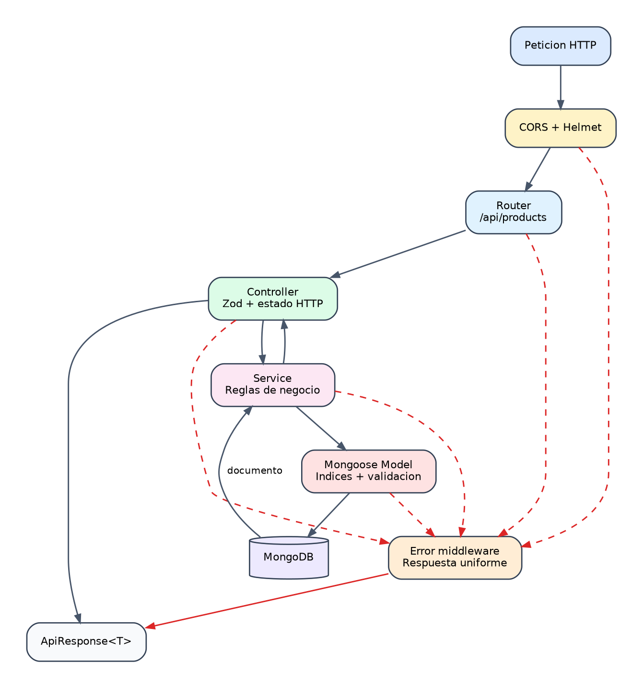

# CRUD backend paso a paso

## 1. Objetivo

Construir una API REST para:

- Categorias de producto.
- Productos.

El caso de uso es el inventario de una clinica veterinaria.

{width=100%}

*Figura 3. Capas y tratamiento de errores del CRUD backend.*

## 2. Contrato HTTP

Categorias:

```text
GET    /api/product-categories
POST   /api/product-categories
GET    /api/product-categories/:id
PATCH  /api/product-categories/:id
DELETE /api/product-categories/:id
```

Productos:

```text
GET    /api/products
POST   /api/products
GET    /api/products/:id
PATCH  /api/products/:id
DELETE /api/products/:id
```

Filtro:

```text
GET /api/products?productCategoryId=:id
```

## 3. Formato de respuesta

Exito:

```json
{
  "data": {},
  "meta": {},
  "error": null
}
```

Error:

```json
{
  "data": null,
  "meta": {},
  "error": {
    "code": "VALIDATION_ERROR",
    "message": "Invalid request"
  }
}
```

## 4. Paso 1: modelos Mongoose

Crear:

```text
server/src/models/product-category.model.ts
server/src/models/product.model.ts
```

### Categoria

Campos:

```text
name
description
requiresPrescription
active
createdAt
updatedAt
```

Decisiones:

- `name` es obligatorio y unico.
- `requiresPrescription` vale `false` por defecto.
- `active` vale `true` por defecto.
- Se usan timestamps.

### Producto

Campos:

```text
name
sku
productCategoryId
description
unitPrice
stockQuantity
minimumStock
expirationDate
active
createdAt
updatedAt
```

Decisiones:

- `sku` es unico y se transforma a mayusculas.
- `productCategoryId` referencia `ProductCategory`.
- Precios y cantidades no pueden ser negativos.
- Nombre, SKU y categoria tienen indices.

## 5. Paso 2: DTO y validacion HTTP

Los esquemas Mongoose protegen la base de datos, pero la entrada HTTP tambien debe validarse.

El proyecto utiliza Zod en los controladores:

```ts
const productSchema = z.object({
  name: z.string().trim().min(2).max(150),
  sku: z.string().trim().min(2).max(50).transform((value) => value.toUpperCase()),
  productCategoryId: z.string().trim().min(1),
  description: z.string().trim().max(1000).optional(),
  unitPrice: z.coerce.number().min(0),
  stockQuantity: z.coerce.number().int().min(0),
  minimumStock: z.coerce.number().int().min(0),
  expirationDate: z.coerce.date().optional(),
  active: z.boolean().default(true)
});
```

Ventajas:

- Rechazo temprano.
- Mensajes de validacion consistentes.
- Conversion controlada de numeros y fechas.
- Menos datos invalidos llegando a los servicios.

## 6. Paso 3: servicios

Crear:

```text
server/src/services/product-category.service.ts
server/src/services/product.service.ts
```

Los servicios contienen las reglas de negocio.

### Categoria

Funciones:

```text
listProductCategories
getProductCategory
createProductCategory
updateProductCategory
deleteProductCategory
```

Regla importante:

```text
Una categoria no puede eliminarse si tiene productos asociados.
```

Implementacion conceptual:

```ts
const productCount = await ProductModel.countDocuments({
  productCategoryId: id
});

if (productCount > 0) {
  throw new AppError(409, "PRODUCT_CATEGORY_IN_USE", "...");
}
```

### Producto

Funciones:

```text
listProducts
getProduct
createProduct
updateProduct
deleteProduct
```

Antes de crear o cambiar la categoria:

```ts
await assertCategoryExists(input.productCategoryId);
```

En consultas de lectura:

```ts
.populate("productCategoryId", "name requiresPrescription active")
```

Esto permite que Angular muestre el nombre y la necesidad de receta.

## 7. Paso 4: errores de dominio

Crear:

```text
server/src/utils/app-error.ts
```

Ejemplo:

```ts
throw new AppError(
  404,
  "PRODUCT_NOT_FOUND",
  "Product not found"
);
```

El middleware central convierte errores en respuestas HTTP.

Casos:

| Situacion | Estado |
| --- | --- |
| ID invalido | 400 |
| Recurso no encontrado | 404 |
| Valor unico duplicado | 409 |
| Categoria utilizada | 409 |
| Error inesperado | 500 |

## 8. Paso 5: controladores

Crear:

```text
server/src/controllers/product-category.controller.ts
server/src/controllers/product.controller.ts
```

Responsabilidad:

1. Leer `params`, `query` y `body`.
2. Validar entrada.
3. Llamar al servicio.
4. Seleccionar estado HTTP.
5. Enviar respuesta.
6. Delegar errores con `next(error)`.

El controlador no debe implementar consultas Mongoose directamente.

## 9. Paso 6: rutas

Crear:

```text
server/src/routes/product-category.routes.ts
server/src/routes/product.routes.ts
```

Ejemplo:

```ts
productRouter.get("/", list);
productRouter.post("/", create);
productRouter.get("/:id", getById);
productRouter.patch("/:id", update);
productRouter.delete("/:id", remove);
```

Registrar en:

```text
server/src/routes/index.ts
```

```ts
apiRouter.use("/product-categories", productCategoryRouter);
apiRouter.use("/products", productRouter);
```

## 10. Paso 7: CORS

Angular puede arrancar en un puerto dinamico durante desarrollo.

La configuracion:

```text
server/src/config/cors.ts
```

Permite:

- `localhost` con cualquier puerto fuera de produccion.
- `127.0.0.1` con cualquier puerto fuera de produccion.
- Origenes exactos definidos en `CLIENT_ORIGIN`.

En produccion:

```dotenv
CLIENT_ORIGIN=https://app.example.com,https://admin.example.com
```

## 11. Paso 8: pruebas

Pruebas actuales:

```text
server/tests/product-models.test.ts
server/tests/cors.test.ts
server/tests/health.test.ts
```

Casos minimos recomendados:

- Defaults de categoria.
- Rechazo de cantidades negativas.
- Categoria inexistente.
- SKU duplicado.
- Categoria en uso.
- ID invalido.
- CORS local.
- CORS externo rechazado.

## 12. Prueba manual

Crear categoria:

```bash
curl -X POST http://localhost:3000/api/product-categories \
  -H "Content-Type: application/json" \
  -d '{
    "name": "Medication",
    "requiresPrescription": true,
    "active": true
  }'
```

Crear producto:

```bash
curl -X POST http://localhost:3000/api/products \
  -H "Content-Type: application/json" \
  -d '{
    "name": "Vacuna canina V10",
    "sku": "VAC-V10",
    "productCategoryId": "CATEGORY_ID",
    "unitPrice": 35.5,
    "stockQuantity": 20,
    "minimumStock": 5,
    "active": true
  }'
```

## 13. Verificacion

```bash
npm run typecheck:backend
npm run lint:backend
npm run test:backend
npm run build:backend
```

## 14. Errores frecuentes

- Acceder a Mongoose desde las rutas.
- Omitir `runValidators` al actualizar.
- No validar ObjectId.
- Permitir eliminar categorias utilizadas.
- Devolver errores internos al cliente.
- No usar indices en SKU o filtros.
- Guardar el nombre de categoria en lugar de su ID.

## 15. Preguntas de revision

1. Por que se valida con Zod y tambien con Mongoose?
2. Por que el servicio comprueba si existe la categoria?
3. Que diferencia hay entre `404` y `409`?
4. Que aporta `populate()`?
5. Por que las reglas de negocio no deben vivir en el controlador?
