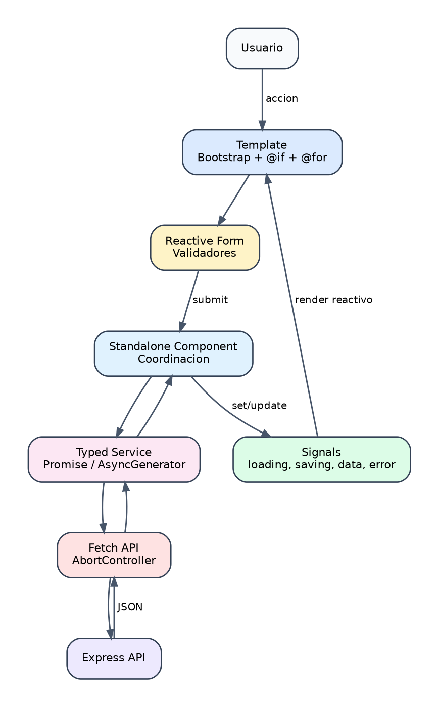

# CRUD frontend paso a paso

## 1. Objetivo

Construir las pantallas Angular para administrar:

- Categorias de productos veterinarios.
- Productos de inventario.

El frontend utiliza:

- Componentes standalone.
- Signals.
- Fetch.
- Promesas tipadas.
- Formularios reactivos.
- Bootstrap.

{width=100%}

*Figura 4. Flujo reactivo del CRUD frontend sin Observables para HTTP.*

## 2. Estructura

```text
client/src/app/
├── core/services/
│   ├── fetch-api.ts
│   ├── product-category.service.ts
│   └── product.service.ts
├── features/
│   ├── product-categories/
│   └── products/
├── shared/models/
│   ├── api-response.model.ts
│   ├── product-category.model.ts
│   └── product.model.ts
└── app.routes.ts
```

## 3. Paso 1: modelos TypeScript

Crear interfaces para datos recibidos y enviados.

Categoria:

```ts
export interface ProductCategory {
  _id: string;
  name: string;
  description?: string;
  requiresPrescription: boolean;
  active: boolean;
  createdAt: string;
  updatedAt: string;
}
```

Producto:

```ts
export interface Product {
  _id: string;
  name: string;
  sku: string;
  productCategoryId: ProductCategory | string;
  description?: string;
  unitPrice: number;
  stockQuantity: number;
  minimumStock: number;
  expirationDate?: string;
  active: boolean;
  createdAt: string;
  updatedAt: string;
}
```

Separar modelos de entrada:

```text
ProductInput
ProductCategoryInput
```

El cliente no envia `_id`, `createdAt` ni `updatedAt` al crear.

## 4. Paso 2: helper Fetch

Archivo:

```text
client/src/app/core/services/fetch-api.ts
```

Responsabilidades:

- Ejecutar Fetch.
- Anadir `Content-Type` cuando hay JSON.
- Convertir respuesta a `ApiResponse<T>`.
- Comprobar `response.ok`.
- Lanzar un error tipado.

Uso:

```ts
return fetchApi<Product[]>(endpoint, { signal });
```

No se utiliza `HttpClient`.

## 5. Paso 3: servicios

### Categorias

```text
ProductCategoryService
```

Metodos:

```ts
list(signal?)
create(input)
update(id, input)
delete(id)
```

### Productos

```text
ProductService
```

Metodos:

```ts
list(productCategoryId?, signal?)
create(input)
update(id, input)
delete(id)
```

Para el filtro:

```ts
const url = new URL(this.endpoint, window.location.origin);
url.searchParams.set("productCategoryId", productCategoryId);
```

## 6. Paso 4: rutas lazy

Archivo:

```text
client/src/app/app.routes.ts
```

```ts
{
  path: "products",
  loadComponent: () =>
    import("./features/products/products.component")
      .then((module) => module.ProductsComponent)
}
```

Rutas:

```text
/products
/product-categories
/status
```

## 7. Paso 5: estado con Signals

Ejemplo:

```ts
readonly products = signal<Product[]>([]);
readonly loading = signal(true);
readonly saving = signal(false);
readonly errorMessage = signal("");
```

Estado derivado:

```ts
readonly productCount = computed(() => this.products().length);
readonly hasCategories = computed(() => this.categories().length > 0);
```

Regla:

- `signal()` para estado mutable.
- `computed()` para valores derivados.
- `effect()` solo para efectos reales.

## 8. Paso 6: carga y cancelacion

Cada lista mantiene un `AbortController`.

```ts
this.productsController?.abort();
this.productsController = new AbortController();
```

Llamada:

```ts
const response = await this.productService.list(
  this.selectedCategoryId() || undefined,
  this.productsController.signal
);
```

Al destruir el componente:

```ts
ngOnDestroy(): void {
  this.productsController?.abort();
}
```

Esto evita mantener peticiones innecesarias al navegar.

## 9. Paso 7: formularios reactivos

Producto:

```ts
readonly form = this.formBuilder.nonNullable.group({
  name: ["", [Validators.required, Validators.minLength(2)]],
  sku: ["", Validators.required],
  productCategoryId: ["", Validators.required],
  unitPrice: [0, [Validators.required, Validators.min(0)]],
  stockQuantity: [0, [Validators.required, Validators.min(0)]],
  minimumStock: [0, [Validators.required, Validators.min(0)]],
  active: [true]
});
```

Antes de guardar:

```ts
if (this.form.invalid) {
  this.form.markAllAsTouched();
  return;
}
```

## 10. Paso 8: crear y actualizar

Se reutiliza el mismo formulario.

Estado:

```ts
readonly editingId = signal<string | null>(null);
```

Seleccion:

```ts
if (editingId) {
  await service.update(editingId, input);
} else {
  await service.create(input);
}
```

Despues:

```ts
this.cancelEdit();
await this.loadProducts();
```

## 11. Paso 9: eliminar

Confirmar la accion:

```ts
if (!window.confirm(`Delete product "${product.name}"?`)) {
  return;
}
```

Despues:

```ts
await this.productService.delete(product._id);
await this.loadProducts();
```

La eliminacion de una categoria puede devolver `409` si tiene productos asociados. El mensaje llega desde el backend.

## 12. Paso 10: plantillas Bootstrap

Elementos utilizados:

```text
navbar
nav-pills
form-control
form-select
form-check
table
table-responsive
badge
alert
btn
btn-group
```

Ejemplo:

```html
<button type="submit" class="btn btn-success">
  Create product
</button>
```

El CSS propio se reserva para:

- Distribucion del formulario.
- Identidad visual veterinaria.
- Indicador de stock bajo.
- Ajustes responsive concretos.

## 13. Paso 11: estados de interfaz

Cada pantalla debe mostrar:

```text
loading
empty
error
ready
saving
```

Ejemplo:

```html
@if (loading()) {
  <p>Loading products...</p>
} @else if (productCount() === 0) {
  <p>No products match this category.</p>
}
```

## 14. Paso 12: filtros

El selector de categoria actualiza:

```ts
selectedCategoryId.set(value);
void loadProducts();
```

El filtrado se realiza en el backend, no sobre una copia local incompleta.

## 15. Pruebas

Pruebas recomendadas:

- El componente se crea.
- El servicio llama al endpoint correcto.
- El formulario rechaza campos invalidos.
- El estado vacio se muestra.
- El error API se muestra.
- El filtro envia `productCategoryId`.
- La cancelacion aborta la peticion.

Comandos:

```bash
npx tsc -p client/tsconfig.app.json --noEmit
npm run test:frontend
npm run build:frontend
```

## 16. Errores frecuentes

- Usar propiedades normales donde se necesita un Signal.
- Olvidar invocar Signals en la plantilla: `products()`.
- Usar `subscribe()` en un proyecto basado en Fetch.
- No comprobar `response.ok`.
- No cancelar peticiones.
- Duplicar estilos que Bootstrap ya proporciona.
- Mezclar llamadas HTTP dentro del componente.
- No manejar el estado vacio.

## 17. Preguntas de revision

1. Que diferencia existe entre `signal()` y `computed()`?
2. Por que los servicios devuelven promesas?
3. Para que sirve `AbortController`?
4. Por que se separan modelos de lectura y entrada?
5. Por que el filtro se aplica en el servidor?
