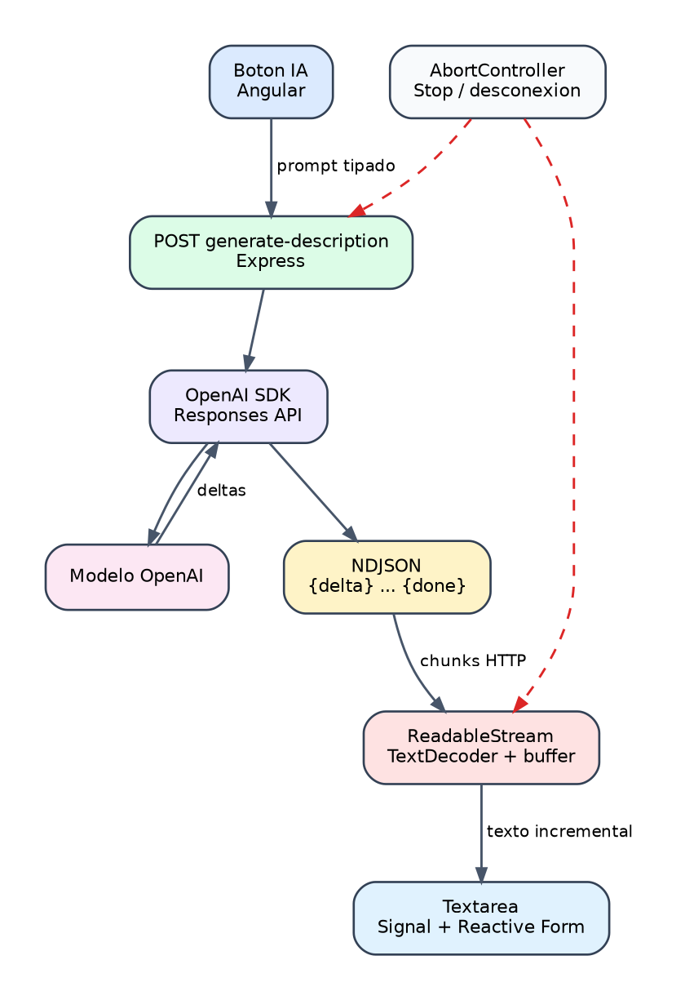

# Generacion de descripciones con OpenAI en streaming

## 1. Objetivo

Incorporar una ayuda de IA al formulario de productos.

Comportamiento:

1. El campo descripcion permanece oculto inicialmente.
2. El usuario introduce nombre y categoria.
3. Pulsa `Generate description with AI`.
4. Angular muestra el campo.
5. El texto aparece progresivamente.
6. El usuario puede detener la generacion.
7. El contenido generado puede editarse antes de guardar.

{width=100%}

*Figura 5. Flujo completo de generación de descripciones en streaming.*

## 2. Arquitectura

```text
Angular form
  -> POST /api/products/generate-description
  -> Express
  -> OpenAI Responses API
  -> stream de eventos
  -> Express convierte a NDJSON
  -> Fetch ReadableStream
  -> textarea Angular
```

La clave OpenAI nunca llega al navegador.

## 3. Variables de entorno

En `.env` de la raiz:

```dotenv
OPENAI_API_KEY=your-real-key
OPENAI_MODEL=gpt-5.4-mini
```

En `.env.example`:

```dotenv
OPENAI_API_KEY=replace-me
OPENAI_MODEL=gpt-5.4-mini
```

Reglas:

- `.env` esta en `.gitignore`.
- No imprimir la clave.
- No copiarla a `client/src/environments`.
- Reiniciar el backend despues de cambiarla.

El backend resuelve `.env` aunque npm ejecute desde `server/`.

## 4. Dependencia

Instalada en el workspace servidor:

```bash
npm install openai -w server
```

La llamada a OpenAI se realiza con el SDK oficial.

## 5. Servicio OpenAI

Archivo:

```text
server/src/services/product-description.service.ts
```

Entrada:

```ts
interface ProductDescriptionInput {
  name: string;
  sku?: string;
  categoryName: string;
  requiresPrescription: boolean;
}
```

Configuracion:

```ts
const client = new OpenAI({
  apiKey: env.OPENAI_API_KEY
});
```

Llamada:

```ts
client.responses.create({
  model: env.OPENAI_MODEL,
  instructions,
  input,
  max_output_tokens: 220,
  stream: true
});
```

## 6. Prompt y seguridad veterinaria

Las instrucciones obligan al modelo a:

- Escribir en espanol.
- Utilizar un tono profesional.
- Generar un solo parrafo corto.
- No usar Markdown.
- No inventar dosis.
- No inventar indicaciones.
- No inventar contraindicaciones.
- No inventar eficacia.
- No inventar aprobaciones regulatorias.
- Avisar sobre autorizacion veterinaria cuando corresponda.

La IA redacta texto de inventario, no prescribe tratamientos.

### Historial de referencia

La funcionalidad se incorporo en `f51acd9` (`feat: stream AI product descriptions`).
Los commits `0941ace` y `0d33653` estabilizaron despues el watcher, la carga de
entorno, CORS, depuracion y el cierre de errores durante el stream. Esta guia
describe el resultado conjunto presente en `main`, no solamente el primer commit.

## 7. Validacion del endpoint

Endpoint:

```text
POST /api/products/generate-description
```

Body:

```json
{
  "name": "Vacuna canina V10",
  "sku": "VAC-V10",
  "categoryName": "Medication",
  "requiresPrescription": true
}
```

Zod valida:

- Nombre obligatorio.
- SKU opcional.
- Categoria obligatoria.
- Indicador booleano de receta.

## 8. Streaming servidor

OpenAI produce eventos como:

```text
response.output_text.delta
```

Express los transforma a NDJSON:

```json
{"type":"delta","text":"Producto"}
{"type":"delta","text":" veterinario"}
{"type":"done"}
```

Si OpenAI falla despues de enviar las cabeceras:

```json
{"type":"error","message":"Safe message"}
```

Esto evita cerrar la conexion de forma abrupta y producir:

```text
ERR_INCOMPLETE_CHUNKED_ENCODING
```

Cabeceras:

```text
Content-Type: application/x-ndjson
Cache-Control: no-cache, no-transform
X-Accel-Buffering: no
```

## 9. Cancelacion servidor

```ts
const controller = new AbortController();
res.on("close", () => controller.abort());
```

Si el navegador cierra o cancela la peticion, el servidor detiene el trabajo upstream.

## 10. Servicio Angular

Metodo:

```ts
async *generateDescription(
  input: ProductDescriptionPrompt,
  signal?: AbortSignal
): AsyncGenerator<string>
```

El servicio:

1. Ejecuta Fetch.
2. Comprueba `response.ok`.
3. Obtiene `response.body`.
4. Lee con `getReader()`.
5. Decodifica bytes con `TextDecoder`.
6. Separa lineas NDJSON.
7. Devuelve cada delta con `yield`.
8. Lanza un error si recibe un evento `error`.

## 11. Parseo incremental

Los fragmentos HTTP no tienen por que coincidir con una linea JSON completa.

Por eso se mantiene:

```ts
let buffer = "";
```

En cada lectura:

```ts
buffer += decoder.decode(value, { stream: true });
const lines = buffer.split("\n");
buffer = lines.pop() ?? "";
```

La ultima parte incompleta permanece en `buffer` hasta recibir mas bytes.

## 12. Signals del componente

```ts
readonly descriptionVisible = signal(false);
readonly generatingDescription = signal(false);
```

Controlador:

```ts
private descriptionController: AbortController | null = null;
```

Al iniciar:

```ts
descriptionVisible.set(true);
generatingDescription.set(true);
description.setValue("");
```

Durante el stream:

```ts
for await (const chunk of service.generateDescription(...)) {
  description.setValue(description.value + chunk);
}
```

## 13. Campo oculto

Plantilla:

```html
@if (descriptionVisible()) {
  <textarea
    class="form-control"
    formControlName="description"
    [attr.aria-busy]="generatingDescription()"
  ></textarea>
}
```

Si se edita un producto con descripcion existente, el campo se muestra inmediatamente.

## 14. Botones

Estados:

```text
Generate description with AI
Regenerate description with AI
Stop
Generating description...
```

El boton de generar se desactiva durante una generacion activa.

Antes de llamar al servidor se valida:

- Nombre.
- Categoria seleccionada.
- Categoria existente en la lista cargada.

## 15. Manejo de errores

Casos:

| Error | Resultado |
| --- | --- |
| Falta clave | `OPENAI_NOT_CONFIGURED` |
| Cuota agotada | Mensaje seguro de facturacion |
| Stream invalido | Error de datos |
| Cancelacion | No mostrar error |
| Error desconocido | Mensaje generico |

Ejemplo de cuota:

```json
{
  "type": "error",
  "message": "OpenAI quota exceeded. Check the API plan and billing configuration."
}
```

## 16. Pruebas

Backend:

```text
server/tests/product-description.test.ts
```

Comprueba que falta de configuracion devuelve error controlado.

Frontend:

```text
client/src/app/core/services/product.service.spec.ts
```

Comprueba:

- Deltas divididos entre chunks.
- Concatenacion del texto.
- Errores HTTP.
- Errores enviados dentro del stream.

Las pruebas no consumen creditos de OpenAI.

## 17. Comprobacion manual

Arrancar MongoDB:

```bash
sudo docker compose up -d mongo
```

Arrancar backend:

```bash
npm run backend
```

Arrancar frontend:

```bash
npm run frontend
```

Abrir:

```text
http://localhost:4200/products
```

Pasos:

1. Crear una categoria.
2. Introducir nombre de producto.
3. Seleccionar categoria.
4. Pulsar el boton IA.
5. Observar el texto progresivo.
6. Detener y volver a generar.
7. Editar el resultado.
8. Guardar el producto.

## 18. Diagnostico

### OPENAI_NOT_CONFIGURED

Comprobar:

```bash
test -f .env
```

Reiniciar backend.

### insufficient_quota

La clave es valida, pero la cuenta no tiene cuota disponible. Revisar plan y facturacion.

### CORS

En desarrollo se admiten puertos locales dinamicos. En produccion configurar `CLIENT_ORIGIN`.

### Stream incompleto

El protocolo NDJSON debe terminar con `done` o `error`; no se debe usar `res.destroy()` para errores normales del proveedor.

## 19. Verificacion

```bash
npm run typecheck:backend
npm run test:backend
npm run test:frontend
npm run build
```

## 20. Mejoras futuras

- Seleccionar tono o longitud.
- Guardar trazabilidad de generacion sin almacenar secretos.
- Moderar entradas.
- Limitar frecuencia por usuario.
- Medir tokens y coste.
- Generar descripciones multilingues.
- Permitir regenerar solo una parte.
